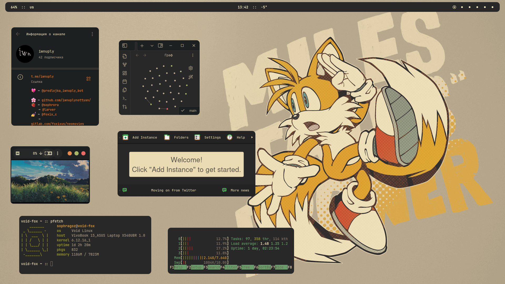

# This is bspwm 



Features:
 - Minimalism
 - Minimal customized programs(kitty,nvim,polybar,wm)
 - For Sonic The Hedgehog's fans

Programs:
 ```bash
 #Add repositories(vscode/prismlauncher)
 sudo zypper addrepo https://download.opensuse.org/repositories/home:getchoo/openSUSE_Tumbleweed/home:getchoo.repo
 sudo zypper ar -cf https://download.opensuse.org/repositories/devel:/tools:/ide:/vscode/openSUSE_Tumbleweed devel_tools_ide_vscode
 sudo zypper refresh

 #install programs
 sudo zypper in bspwm nitrogen rofi polybar lxappearance htop neovim git prismlauncher steam telegram-desktop transmission-gtk java-21-openjdk krita vlc code nvidia-drivers-G06 docker firefox eog nemo xournalpp intel-gpu-tools zsh pulseaudio pavucontrol libwebkit2gtk-4_1-0
 ```

---

