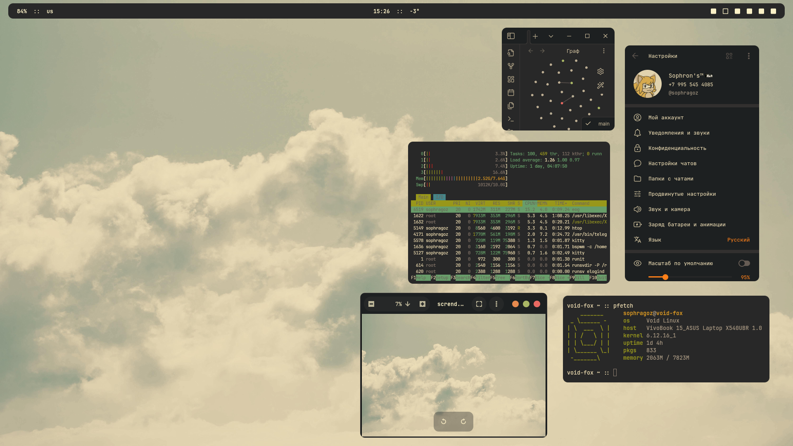
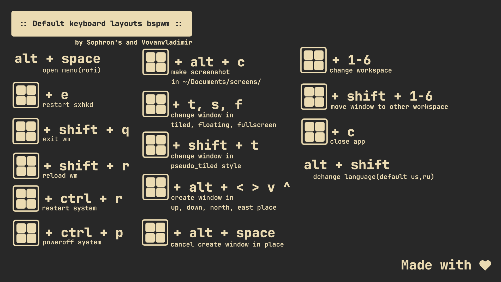

# Sophron's dots gruvbox

### Preview


### Layouts


### Themes for:
 - Telegram: [click](https://github.com/indev29/telegram-gruvbox)
 - Icons: [click](https://github.com/SylEleuth/gruvbox-plus-icon-pack)
 - gtk: [click](https://github.com/Fausto-Korpsvart/Gruvbox-GTK-Theme)
 - kvantum(aka qt5/6): [click](https://github.com/sachnr/gruvbox-kvantum-themes)
 - cursor: [click](https://store.kde.org/p/1818760)
 - Obsidian: [click](https://github.com/insanum/obsidian_gruvbox)
 - code OSS(vscode): [click](https://github.com/jdinhify/vscode-theme-gruvbox)
 - Steam: [click](https://flathub.org/apps/io.github.Foldex.AdwSteamGtk)
 - Chromium: [click](https://chromewebstore.google.com/detail/gruvbox-material-dark/fjofdcgahcnlkdjapcbeonbnmjdnfcki)

### Main programs:
 > bspwm rofi sxhkd polybar nitrogen lxappearance htop neovim git zsh pulseaudio pavucontrol libwebkit2gtk chronyd dhcpcd polkitd unzip psmisc xclip scrot dunst 

### Other programs:
> htop PrismLauncher steam telegram-dekstop transmission-gtk openjdk21 krita vlc vscode nvidia nvidia-dkms filezilla eog nemo xournalpp intel-gpu-tools libwebkit2gtk lutris

### if you like my dots and want to contribute then make a pull request
### To-Do:
 - Create bash script for installation dots. (Testing stage)
 - migrate bar from polybar to eww
 - make notification demon (aka dunst)
 - ~~make logout menu (then migrate to eww)~~ migration to eww remains
 - Widget in workspace (conky)
 - Rules for apps 
 - Grub theme
 - Display manager
 - Plymouth
 - Add screenshot widget
 - Add support for small monitors

### Installation:
```bash
# * Create folders for installing themes,icons,configs
mkdir ~/.config
mkdir ~/.icons
mkdir ~/.themes
mkdir ~/.fonts

# * Clone the repo in any folder
git clone https://github.com/sophragoz/bspwm
cd bspwm

# * Copy .config and .xinitrc folder in ~/ directory
cp -r .config ~/
cp -r .xinitrc ~/

# * Install plug-vim, and Install plugin theme
curl -fLo ~/.vim/autoload/plug.vim --create-dirs \
    https://raw.githubusercontent.com/junegunn/vim-plug/master/plug.vim
# :PlugInstall
# :wq

# * Make executable bspwmrc, .xinitrc and sxhkdrc for starting wm
chmod +x ~/.config/bspwm/bspwmrc
chmod +x ~/.config/sxhkd/sxhkdrc
chmod +x ~/.xinitrc

# * Download cursor, icons, themes, fonts
mkdir tmp-folder
cd tmp-folder
wget https://github.com/SylEleuth/gruvbox-plus-icon-pack/releases/download/v6.1.1/gruvbox-plus-icon-pack-6.1.1.zip # icon theme
wget https://github.com/sainnhe/capitaine-cursors/releases/download/r5/Linux.zip # cursor theme
git clone https://github.com/Fausto-Korpsvart/Gruvbox-GTK-Theme # gtk theme(qt you can install it later if you need it)
wget https://download.jetbrains.com/fonts/JetBrainsMono-2.304.zip # defaults fonts
wget https://github.com/ryanoasis/nerd-fonts/releases/download/v3.3.0/NerdFontsSymbolsOnly.zip # fonts for symbols

# * Unpack archives
unzip gruvbox-plus-icon-pack-6.1.1.zip
unzip Linux.zip
unzip JetBrainsMono-2.304.zip
unzip NerdFontsSymbolsOnly.zip

# * Install and copy themes/fonts
# * For your convenience, the names of the directories within the topics will be shortened
cp -r Gruvbox-Plus-Dark ~/.icons/icon
cp -r Capitaine\ Cursors\ \(Gruvbox\)\ -\ White/ ~/.icons/cursor
rm -r fonts/ttf/JetBrainsMonoNL-* #OPTIONAL! because you might need it
cp -r fonts/ttf/* ~/.fonts/
cp -r SymbolsNerdFontMono-Regular.ttf ~/.fonts/

# * Install defualt gruvbox gtk theme(using bash script)
cd Gruvbox-GTK-Theme/themes
chmod +x install.sh
./install.sh -t default

# * (Optional) Install qt theme
wget https://github.com/sachnr/gruvbox-kvantum-themes/releases/download/1.1/Gruvbox-Dark-Blue.tar.gz
tar -xfv Gruvbox-Dark-blue.tar.gz
# go to kvantum manager, and select the directory with this theme and install.
# then select it from the list of installed ones
# Done!

# * Cleaning tmp files
clear
rm -rf ~/tmp-folder

# ! Themes won't install themselves, so go to lxappearance and select theme/icons/cursor, as well as font

# * Done! Have a nice day!
```

### Authors:
> [Sophron's](https://github.com/sophragoz)

> [Vovanvladimir](https://github.com/Vovanvladimir)

# Made with love
