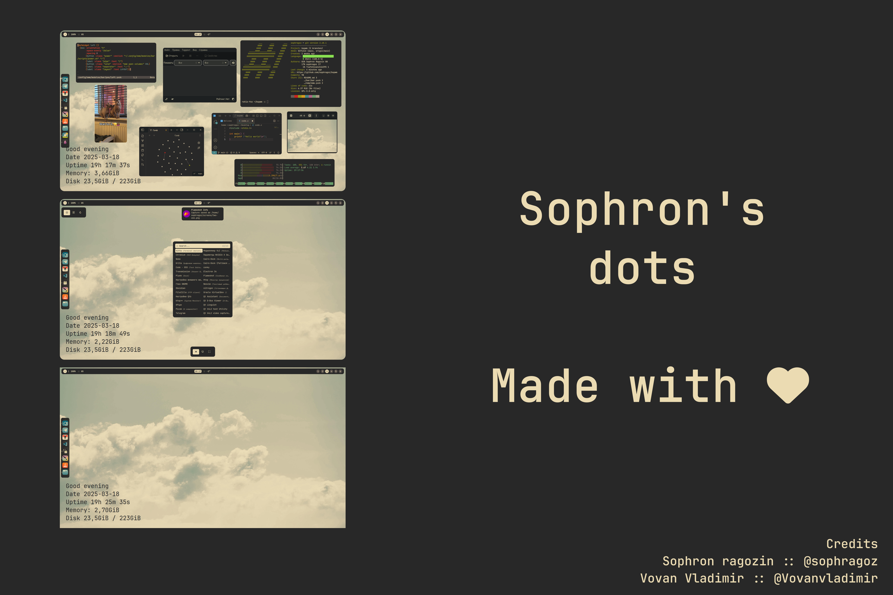

<details>
 <summary>Screenshots</summary>
 
 
 
 
 
</details>

### Themes for:
 - Telegram: [click](https://github.com/indev29/telegram-gruvbox)
 - Icons: [click](https://github.com/SylEleuth/gruvbox-plus-icon-pack)
 - gtk: [click](https://github.com/Fausto-Korpsvart/Gruvbox-GTK-Theme)
 - kvantum(aka qt5/6): [click](https://github.com/sachnr/gruvbox-kvantum-themes)
 - cursor: [click](https://store.kde.org/p/1818760)
 - Obsidian: [click](https://github.com/insanum/obsidian_gruvbox)
 - code OSS(vscode): [click](https://github.com/jdinhify/vscode-theme-gruvbox)
 - Steam: [click](https://flathub.org/apps/io.github.Foldex.AdwSteamGtk)
 - Chromium: [click](https://chromewebstore.google.com/detail/gruvbox-material-dark/fjofdcgahcnlkdjapcbeonbnmjdnfcki)

> [!WARNING]  
> Dots currently supporting resolution is 1920x1080.
> Didn't Supports in other resolutions.

### Programs:
```
bspwm rofi sxhkd polybar nitrogen lxappearance htop neovim git zsh unzip xclip scrot dunst conky cairo-dock jq
```

### FAQ
 - 1: what's happened polybar-air.ini? This is a fix for the eww bug, see commit [#178](https://github.com/elkowar/eww/issues/178)
 - 2: Why Script installer works with errors? The script is currently being tested, it may contain errors, if you find an error, please report it in the commit

### Installation:
<details>
 <summary>Install manually</summary>
 
```bash
# * Create folders for installing themes,icons,configs
mkdir ~/.config
mkdir ~/.icons
mkdir ~/.themes
mkdir ~/.fonts

# * Clone the repo in any folder
git clone https://github.com/sophragoz/bspwm tmp/bspwm
cd bspwm

# * Copy .config and .xinitrc folder in ~/ directory
cp -r .config ~/
cp -r .xinitrc ~/
cp -r .conkyrc ~/

# * Make executable bspwmrc, .xinitrc and sxhkdrc for starting wm
chmod +x ~/.config/bspwm/bspwmrc
chmod +x ~/.config/sxhkd/sxhkdrc
chmod +x ~/.xinitrc

# * Download cursor, icons, themes, fonts
mkdir tmp
wget -P tmp/ https://github.com/SylEleuth/gruvbox-plus-icon-pack/releases/download/v6.1.1/gruvbox-plus-icon-pack-6.1.1.zip # icon theme
wget -P tmp/ https://github.com/sainnhe/capitaine-cursors/releases/download/r5/Linux.zip # cursor theme
git clone https://github.com/Fausto-Korpsvart/Gruvbox-GTK-Theme tmp/Gruvbox-GTK-Theme # gtk theme(qt you can install it later if you need it)
wget -P tmp/ https://download.jetbrains.com/fonts/JetBrainsMono-2.304.zip # defaults fonts
wget -P tmp/ https://github.com/ryanoasis/nerd-fonts/releases/download/v3.3.0/NerdFontsSymbolsOnly.zip # fonts for symbols

# * Unpack archives
unzip tmp/gruvbox-plus-icon-pack-6.1.1.zip -d tmp/
unzip tmp/Linux.zip -d tmp/
unzip tmp/JetBrainsMono-2.304.zip -d tmp/
unzip tmp/NerdFontsSymbolsOnly.zip -d tmp/

# * Install and copy themes/fonts
# * For your convenience, the names of the directories within the topics will be shortened
cp -r tmp/Gruvbox-Plus-Dark ~/.icons/icon
cp -r tmp/Capitaine\ Cursors\ \(Gruvbox\)\ -\ White/ ~/.icons/cursor
rm -r tmp/fonts/ttf/JetBrainsMonoNL-* #OPTIONAL! because you might need it
cp -r tmp/fonts/ttf/* ~/.fonts/
cp -r tmp/SymbolsNerdFontMono-Regular.ttf ~/.fonts/

# * Install defualt gruvbox gtk theme(using bash script)
chmod +x /tmp/Gruvbox-GTK-Theme/themes/install.sh
./tmp/Gruvbox-GTK-Theme/themes/install.sh -t default

# * (Optional) Install qt theme
wget -P tmp/ https://github.com/sachnr/gruvbox-kvantum-themes/releases/download/1.1/Gruvbox-Dark-Blue.tar.gz
tar -xfv Gruvbox-Dark-blue.tar.gz 
# go to kvantum manager, and select the directory with this theme and install.
# then select it from the list of installed ones
# Done!

# * Install plug-vim, and Install plugin theme
sh -c 'curl -fLo "${XDG_DATA_HOME:-$HOME/.local/share}"/nvim/site/autoload/plug.vim --create-dirs \
       https://raw.githubusercontent.com/junegunn/vim-plug/master/plug.vim'
# :PlugInstall
# :wq

# * Cleaning tmp files
clear
rm -rf tmp

# ! Themes won't install themselves, so go to lxappearance and select theme/icons/cursor, as well as font

# * Done! Have a nice day!
```

</details>
<details>
  <summary> Install using bash script(Experemental!!)</summary>

#### Supported distros in package manager:
 - apt/apt-get(Debian based)
 - pacman(Arch based)
 - zypper
 - xbps
##### if the bash script does not work, or there is no support for your distribution, please write in issue.
```bash
/bin/bash -c "$(curl -fsSL https://raw.githubusercontent.com/sophragoz/bspwm/refs/heads/main/installer.sh)"
```

</details>

### Authors:
> [Sophron's](https://github.com/sophragoz)

> [Vovanvladimir](https://github.com/Vovanvladimir)
------
